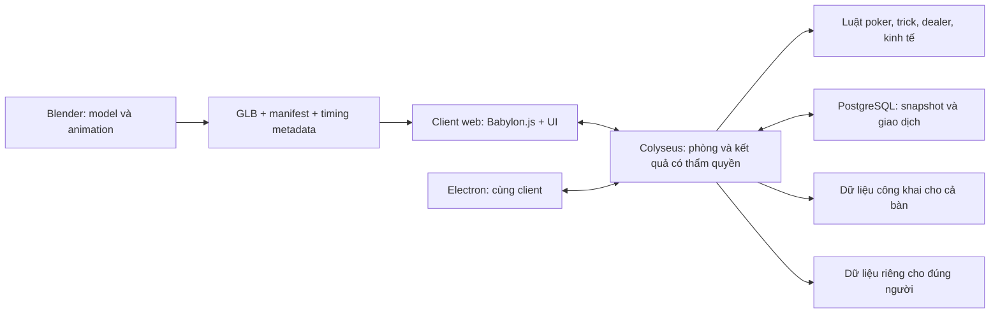

# KẾ HOẠCH PHÁT TRIỂN VÀ TÍCH HỢP

**Phiên bản:** 0.1 — ngày 04/10/2026.  
**Căn cứ:** [GAME_RULES.md v0.3](./GAME_RULES.md), [CONTENT_CATALOG.md](./CONTENT_CATALOG.md) và [BLENDER_RULES.md](./BLENDER_RULES.md).  
**Trạng thái:** kế hoạch để thảo luận và thực hiện ở bước tiếp theo; chưa có game, model hoàn chỉnh hoặc server được triển khai.

## 1. Mục tiêu bàn giao

Một game multiplayer 3D chơi bằng trình duyệt: 4 người ngồi trong saloon miền Viễn Tây, chơi Texas Hold’em, giấu số dư, thực hiện trick, nghi binh, tố cáo, mua đồ, mua lợi thế dealer, cược/bán ngón và lắp ngón giả. Bản desktop dùng lại phần game và kết nối cùng hệ thống phòng.

Giữ dealer trong bản chơi thử có đủ vòng lặp. Cơ chế mất máu đã bị loại khỏi luật, dữ liệu, UI, âm thanh và danh sách tài nguyên cần làm.

Thông số 4 người, no-limit, ngưỡng ngón thật, hình phạt tố cáo, kinh tế theo trận và bộ nhân vật thú nhân là các **giả định đề xuất** của v0.3. Theo dõi D1–D5 ở cuối file luật; không ghi chúng thành yêu cầu đã được người dùng xác nhận.

## 2. Tech stack đề xuất để xây kế hoạch

Đây là phương án khuyến nghị để thảo luận, chưa phải quyết định stack của người dùng.

| Phần | Đề xuất | Lý do cho dự án này |
| --- | --- | --- |
| Game client | TypeScript + Babylon.js | Cần cảnh 3D, nhân vật có rig, hoạt ảnh tay, camera, âm thanh theo vị trí và tải GLB |
| Build web | Vite | Chạy thử cục bộ và tạo static build |
| Giao diện | React + CSS, tách khỏi vòng render 3D | Sảnh, cửa hàng, HUD, hộp thoại và trạng thái kết nối |
| Multiplayer | Node.js LTS + Colyseus qua WebSocket | Phòng chơi và một server quyết định kết quả cho cả bàn |
| Luật và giao thức | TypeScript package thuần + kiểm tra dữ liệu đầu vào | Dễ kiểm thử poker, giao dịch và timing độc lập khỏi hình ảnh |
| Lưu dữ liệu | PostgreSQL khi chuyển sang alpha có lưu trữ | Phiên chơi, giao dịch, kết quả, snapshot và event phục hồi |
| Model/animation | Blender 4.5 LTS, Python dựng/export + chỉnh thủ công khi cần | Có nguồn .blend chỉnh được và asset .glb đưa vào game |
| Desktop | Electron + công cụ đóng gói của Electron | Tái sử dụng client web, tải cùng GLB và chơi chung với trình duyệt |
| Kiểm thử | Vitest, test nhiều client, Playwright, glTF Validator | Tách kiểm tra luật, mạng, UI và tài nguyên |
| Chạy server | Docker Compose: reverse proxy HTTPS/WSS + app server + database | Đường triển khai một máy chủ dễ vận hành cho alpha |
| Quản lý repo | npm workspaces, lockfile, Git và LFS cho nguồn nhị phân | Một repo cho client, server, protocol và pipeline tài nguyên |

Babylon.js có hỗ trợ glTF, skeleton/animation, camera và audio trong hệ thống engine. Việc chọn nó cho dự án là nhận định thiết kế dựa trên nhóm nhu cầu trên. [Tài liệu tính năng Babylon.js](https://www.babylonjs.com/specifications/).

Colyseus cung cấp phòng và đồng bộ state; dữ liệu được đồng bộ cần được phân quyền cẩn thận vì state mặc định có thể được gửi cho toàn bộ client. [State synchronization](https://docs.colyseus.io/state), [per-client visibility](https://docs.colyseus.io/state/view).

**Vì sao thay đổi gợi ý Three.js trước đó:** phạm vi hiện đã rõ là một game có nhiều hoạt ảnh tay, NPC dealer và tín hiệu âm thanh. Babylon.js là hướng đề xuất để gom các phần đó. Three.js vẫn phù hợp nếu muốn tự xây nhiều hệ thống; chưa có code nào phải chuyển đổi.

### So sánh ngắn trước khi chốt

| Phương án | Điều phải cân nhắc |
| --- | --- |
| Babylon.js + TypeScript | Hướng đề xuất của kế hoạch; cần tự làm gameplay/editor tools cho game cụ thể |
| Three.js + TypeScript | Linh hoạt; phải tự tổ chức thêm animation, audio và công cụ gameplay |
| Engine có editor như Godot | Cần một vòng thử riêng cho build web, kết nối server và asset trước khi thay phương án đề xuất |

Chốt phiên bản cụ thể bằng một vòng cài đặt/build kiểm tra ở M0 và ghi lockfile. Không gán “latest” làm yêu cầu ổn định lâu dài.

## 3. Kiến trúc tích hợp



### 3.1. Trách nhiệm

- **Client:** hiển thị, nhận input, dự đoán hoạt ảnh cục bộ, thanh timing, phát âm thanh và trình bày thông tin được phép biết.
- **Server:** xáo/chia bài, kiểm tra hành động, xác định timing, kết quả trick/tố cáo, cược, pot phụ, hợp đồng dealer, mua bán, ngón và điều kiện loại.
- **Luật thuần:** chuyển trạng thái theo lệnh đã hợp lệ; không phụ thuộc browser, Babylon, database hoặc thời gian máy người chơi.
- **Blender:** hình học, rig, clip và điểm gắn đồ. Hoạt ảnh không tự quyết định việc đổi bài hoặc chuyển tiền.
- **Database:** lưu trữ và phục hồi; không đặt mỗi khung hình 3D thành một lần ghi database.

### 3.2. Dữ liệu bí mật

Ưu tiên state đồng bộ chỉ chứa dữ liệu công khai. Bài kín, số dư, kho, deck, hợp đồng và hồ sơ phân xử giữ trong dữ liệu riêng trên server; gửi snapshot/delta riêng cho người có quyền. Nếu dùng StateView thay thế, phải có test chứng minh bộ lọc hoạt động với cả join và reconnect.

- Không gửi bài đối thủ rồi dùng CSS hoặc mặt lưng để che.
- Không gửi nhãn `realTrick`, tên hiệu ứng bí mật hoặc seed timing riêng trong sự kiện cho đối thủ. Sự kiện công khai chỉ mô tả dấu hiệu được phép thấy/nghe.
- Mặt lưng lá dùng định danh hiển thị không làm lộ danh tính cố định của mọi lá qua nhiều lần xáo. Dấu đánh bài được xử lý riêng theo quyền quan sát.
- Dealer chỉ cấp mẩu thông tin đã mua; không gửi nguyên deck cho client.
- Log công khai, analytics và replay cho người xem phải loại thông tin kín.

### 3.3. Timing và mạng

Một trick có ID duy nhất, chủ thể, cấu hình, thời điểm bắt đầu, mốc cam kết, thời hạn và trạng thái kết thúc. Server cấp phiên timing loại A; client gửi lần bấm, không gửi câu khẳng định “tôi thành công”.

Đồng bộ thời gian bằng mẫu ping, kiểm tra timestamp và thứ tự, giới hạn bù trễ; server tính kết quả theo cấu hình đã cấp. Test độ trễ và jitter trước khi chốt vùng timing. Không tin tùy ý timestamp do client tự khai.

Loại B gửi yêu cầu bắt đầu mục tiêu hợp lệ; server xác nhận hoàn tất/gián đoạn theo lịch. Không tạo minigame hoặc roll thất bại ngẫu nhiên để thay thế việc chọn thời điểm.

Xác thực phía server ngăn sửa kết quả/tài nguyên, nhưng không bảo đảm ngăn được mọi phần mềm tự động bấm timing. Đây là giới hạn phải đánh giá khi có bản thật; không hứa chống mọi kiểu gian lận ngoài luật game.

### 3.4. Quy tắc giao thức

- Mỗi lệnh có `commandId`, phiên người chơi, `handId`, số thứ tự và dữ liệu theo schema; server suy ra chủ thể từ phiên đã xác thực.
- Bỏ qua lệnh trùng, từ chối lệnh sai giai đoạn/mục tiêu/chi phí hoặc payload quá giới hạn.
- Sự kiện có số thứ tự tăng dần; reconnect nhận snapshot được lọc và đồng bộ lại sự kiện tiếp theo.
- Các đồng hồ theo thời gian server; đóng tab không đóng băng trận hoặc cho bấm lại minigame.
- Pose/gaze có giới hạn góc và tần suất, được nội suy khi hiển thị. Camera không được gửi yêu cầu xem tùy ý bài ngoài tầm nhìn.
- Hợp đồng, mua bán, pot và thế chấp dùng giao dịch có thể thử lại mà không trả tiền/hàng hai lần.

## 4. Cấu trúc repo dự kiến

```text
apps/
  web/                   # scene 3D, React UI, input, audio, network client
  server/                # rooms, session, dealer, phân xử, lưu trữ
  desktop/               # Electron shell và đóng gói
packages/
  rules/                 # poker, trick, thế chấp, buff và state machine thuần
  protocol/              # schema lệnh và dữ liệu công khai/riêng
  content/               # bảng vật phẩm, trick, dealer, thông số cân bằng
  asset-contract/        # tên node, bones, clips, sockets và manifest
assets/
  blender/               # nguồn .blend, texture, xuất bản nguồn
  previews/              # ảnh kiểm tra model và góc bàn
  manifests/             # inventory tài nguyên và marker hoạt ảnh
public/models/           # GLB đã qua kiểm tra, được build web sử dụng
scripts/blender/         # script tạo, kiểm tra và export trong tương lai
tests/                   # integration, nhiều client, fixtures và test tài nguyên
infra/                   # Docker, proxy, môi trường, backup và hướng dẫn vận hành
```

Đây là cấu trúc dự kiến, chưa được tạo thành ứng dụng. Các thư mục rỗng ban đầu sẽ được tổ chức lại ở M0. Tên luật/vật phẩm trong content phải ánh xạ được tới tài nguyên và test.

## 5. Các mốc công việc và điều kiện hoàn thành

### M0 — Chốt các quy tắc ảnh hưởng nền tảng và kiểm chứng stack

**Đầu vào:** luật v0.3, D1–D5, quy tắc Blender.

**Công việc:**

- Thảo luận stack; chọn máy/trình duyệt tham chiếu và mức chất lượng.
- Chốt D1, D2 và bảng tình huống D3 đủ để viết chuyển trạng thái.
- Ghi bảng pot phụ với tiền mặt/ngón: thắng, hòa, fold, all-in thiếu raise, mất một pot nhưng thắng pot khác.
- Thử load một GLB có rig, ngón tách mesh, 2 clip và socket trong engine đã chọn.
- Thử 2 client nhận dữ liệu công khai giống nhau và dữ liệu kín khác nhau.
- Tạo workspace/build/kiểm tra kiểu và khóa phiên bản khi bắt đầu triển khai.
- Đặt ignore cho bộ cài/công cụ cục bộ, dependency và build output; không đưa file cài Blender trong `.tools` vào bản game hoặc Git LFS asset.

**Bàn giao:** quyết định stack, cấu hình luật đầu tiên, asset contract và hai bài kiểm chứng nhỏ.

**Đạt khi:** GLB hoạt động đúng; private payload không lộ; các tình huống thế chấp có kết quả được giải thích duy nhất. Các phần ít phụ thuộc có thể tiếp tục trong khi thảo luận, nhưng chưa viết thanh toán dựa trên D3 còn mơ hồ.

### M1 — Texas Hold’em multiplayer chạy được bằng hình khối đơn giản

**Phụ thuộc:** phần protocol và poker của M0.

**Công việc:**

- Tạo/join phòng bằng mã, chọn ghế, ready, phiên khách và token kết nối lại.
- Server xáo bài bằng nguồn ngẫu nhiên phù hợp; seed cố định chỉ dùng trong test.
- Hand evaluator, thứ tự lượt/blind, legal actions, all-in, pot phụ, showdown và kết quả.
- HUD bài riêng, pot, lượt, cược, số dư riêng; giao diện chia tay thắng/thua rõ.
- Timeout, disconnect/reconnect, người xem chỉ thấy dữ liệu công khai.
- Triển khai staging một instance có HTTPS/WSS để thử nhiều máy thực, không chỉ nhiều tab cùng máy.

**Đạt khi:** 4 client hoàn thành nhiều ván gồm pot phụ/hòa/timeout; cùng một kết quả, không thể tiêu tiền hai lần hoặc đọc bài người khác trong payload.

### M2 — Trick, nghi binh, tố cáo và âm thanh đồng bộ

**Phụ thuộc:** M1; bộ tay/hoạt ảnh thử đầu từ A1 ở mục 6.

**Công việc:**

- Thanh chạy qua lại, một lần bấm, kết quả có thẩm quyền và bù trễ giới hạn.
- T01 tráo bài; T02 đánh dấu không minigame; F01/F02 dùng cùng kiểu dấu hiệu công khai.
- Mốc chuẩn bị/cam kết/hoàn tất, tạm dừng khi tố, cửa sổ tố và khóa chuyển vòng đúng lúc.
- Phân xử đúng/sai, tiền cọc, phạt, chống tố trùng; không làm lộ toàn bộ inventory.
- Audio theo vị trí, animation event ID và chống phát trùng sau reconnect.
- T03 gương: cấp thông tin theo điều kiện nhìn hợp lệ; bản đồ phản chiếu trang trí không mang dữ liệu bài kín.
- H02 che bài là đối sách có sẵn cho mọi người; bảo đảm tín hiệu nhìn bài và điều kiện gương khớp nhau từ các ghế.

**Đạt khi:** đối thủ có thể quan sát dấu hiệu trên máy khác; loại B không có thanh timing; gửi lệnh “thành công” giả không đổi bài; mạng trễ không cho làm lại hoặc xử tố hai lần.

### M3 — Cửa hàng, ngón tay, ngón giả và dealer trong vòng chơi

**Phụ thuộc:** M1–M2, D1–D3 được giải quyết, bàn tay module và dealer A2.

**Công việc:**

- Cửa hàng sảnh/giữa ván; giá khác nhau; kho và cồng kềnh; bán đồ.
- Gán 10 ngón, yêu cầu ngón của trick, bán ngón, tín dụng thế chấp và thanh toán theo pot.
- Thay mesh thật/trống/giả; lắp giữa ván; lỗi trick phát tiếng đúng vị trí một lần.
- Dealer chia bài, nhận thỏa thuận, DLR01 tin riêng và DLR02 xao nhãng.
- Kiểm tra loại theo ngón/phá sản, cửa sổ cứu nguy và ván kế tiếp.
- Cài bộ P0 từ CONTENT_CATALOG: I01–I04/I09, B01–B03; có buff cứu phá sản để chơi hết vòng lặp ngay tại mốc này.

**Đạt khi:** một trận thử có mua đồ, cược/bán ngón, lắp giả, làm trick và mua lợi thế dealer từ đầu đến kết thúc. Không có HP, tick máu hoặc vật phẩm cầm máu trong runtime.

### M4 — Hoàn thiện kinh tế, hợp đồng dealer và ma thuật

**Phụ thuộc:** M3, quyết định kinh tế D4.

**Công việc:**

- Mua khẩn trong ván, giao hàng và áp dụng tải đúng thời điểm; khóa khi tiền/cược không cho phép.
- Bài dự trữ có giới hạn và quy tắc bộ 52 lá xuyên nhiều ván; dấu đánh bài tồn tại đúng vòng đời.
- DLR03 cắt bài có lợi; đặt chỗ/xung đột, thông tin đã bán, tố/hủy/hoàn tiền.
- Buff hết trận, hiệu ứng một lần, cứu phá sản; xác định thứ tự và giới hạn cộng dồn.
- Mở rộng nội dung P1 theo từng nhóm: T05/T06 dấu và dấu giả; T07 đổi đôi; F03/H01 âm thanh/nghi binh; I05–I08/I10; DLR04 và B04–B10. Dùng cùng hệ thống content, không viết riêng một minigame cho mỗi món.
- B08 cần cửa sổ dùng phép công khai sau nhận bài và trước cược đầu tiên; B05 phải giữ dấu hiệu lỗi lần đầu khi cho bấm lại. Kiểm tra tương tác trước khi bật trong cấu hình phòng.
- Tìm và sửa vòng giao dịch tạo tiền/đồ vô hạn; mô phỏng nhiều trận để tìm cấu hình không thể kết thúc.

**Đạt khi:** toàn bộ cơ chế người dùng yêu cầu có trong một trận chơi được; giá trị tiền, bài, đồ và ngón được đối soát qua giao dịch và trạng thái cuối.

### M5 — Tích hợp hình ảnh saloon và trải nghiệm người chơi

**Phụ thuộc:** M2–M4 và A3; chuẩn bị tài nguyên có thể diễn ra xen kẽ các mốc trước.

**Công việc:**

- Thay hình khối thử bằng saloon, 4 nhân vật, dealer, bàn, bài, chip và đạo cụ theo Blender rules.
- Ánh sáng ấm, vật liệu gỗ/da/đồng, UI miền Viễn Tây, camera giới hạn và chuyển động đầu/tay đọc được.
- Âm thanh môi trường giảm dưới tín hiệu quan trọng; tùy chọn giảm rung/chuyển động và remap phím.
- Hướng dẫn Hold’em, timing, marking, tố cáo và thế chấp bằng tình huống ngắn.
- Trạng thái lỗi mạng, tải asset, kết nối lại; thao tác mute/âm lượng và phản ứng nhanh.
- Kiểm tra low/medium quality, nhiều tỉ lệ màn hình và các trình duyệt mục tiêu.

**Đạt khi:** chơi được bằng đồ họa thật từ tất cả ghế; nhìn được dấu hiệu mà không cần mở màn hình debug; nguyên liệu và hoạt ảnh không làm lộ bí mật qua tên node/sự kiện.

### M6 — Alpha online và vận hành

**Phụ thuộc:** M4; tích hợp/QA M5 đủ dùng.

**Công việc:**

- PostgreSQL: migrations, phiên/trận, ledger giao dịch, snapshot có version và event log phục hồi.
- Snapshot + event phải đủ tái tạo deck/kho/đánh dấu/hợp đồng và tiền; tách reconnect client với phục hồi server chết.
- Giới hạn lệnh, chống payload bất hợp lệ, phiên giả, giao dịch trùng và rò dữ liệu log.
- Health check, log có cấu trúc, số phòng/client, độ trễ xử lý, lỗi reconnect; không đưa bí mật người chơi vào dashboard công khai.
- Backup/restore database; drain phòng trước cập nhật; rollback build/schema theo hướng dẫn.
- Load test tăng dần theo số phòng trên hạ tầng đã chọn. Redis/routing nhiều instance chỉ thêm khi số đo yêu cầu.
- Chơi thử có người thật; điều chỉnh thời gian, giá, cọc tố và thời lượng trận theo quan sát.

**Đạt khi:** hoạt động qua mạng ngoài, khôi phục phiên được kiểm tra, backup được phục hồi thử, có runbook triển khai/cập nhật/sự cố. Sức chứa được báo theo phép đo thực, không ước đoán thành cam kết.

### M7 — Desktop và phát hành bản thử

**Phụ thuộc:** cùng build web và protocol ổn định từ M5–M6.

- Đóng gói client vào Electron; cấu hình địa chỉ server theo môi trường, asset path hoạt động khi đóng gói.
- Renderer sandbox, context isolation, tắt Node integration, preload/IPC tối thiểu và CSP. Đây là cấu hình dựa trên [hướng dẫn bảo mật Electron](https://www.electronjs.org/docs/latest/tutorial/security).
- Kiểm tra phím, fullscreen, DPI, âm thanh, mất focus và kết nối lại trên desktop.
- Test Windows và macOS bằng môi trường tương ứng; không coi build được trên một hệ điều hành là đã kiểm tra hệ điều hành khác.
- Chuẩn bị ký/notarize/installer khi chọn cách phân phối; ghi riêng yêu cầu tài khoản/chứng chỉ và chi phí nếu phát sinh.
- Bàn giao mã nguồn, nguồn Blender, build web/desktop, tài liệu chạy local/server và danh sách giới hạn đã biết.

**Đạt khi:** người dùng web và desktop vào cùng bàn, chơi trọn trận, tải đúng model và nhận kết quả nhất quán.

## 6. Luồng sản xuất model và hoạt ảnh

| Đợt | Tài nguyên | Dùng ở đâu | Điều kiện chuyển bước |
| --- | --- | --- | --- |
| A0 | Phòng/bàn/ghế dạng khối, tay mẫu 5 ngón, GLB thử | M0–M1 | Tỉ lệ và góc nhìn thấy được tay/bài |
| A1 | 1 nhân vật hoàn chỉnh, 10 ngón tháo được, ngón giả, T01/T02/F01 | M2 | Import đúng rig; thao tác thật/giả đọc được ở mọi ghế |
| A2 | Dealer, chia/cắt/ra hiệu, chip, gương, dụng cụ đánh dấu | M3–M4 | Socket và mốc áp dụng khớp gameplay; tiếng không lệch động tác |
| A3 | 3 nhân vật thêm, saloon hoàn chỉnh, vật liệu, LOD, clip biểu cảm | M5 | Giữ cùng rig/contract; đạt ngân sách và QA góc chơi |

Danh sách P0/P1 và ánh xạ từng ID sang prop/animation được quản lý trong CONTENT_CATALOG. Các món P1 cần thêm biến thể động tác và texture/icon, nhưng ưu tiên tái sử dụng rig, mesh bài ma thuật và hệ thống event.

Thứ tự mỗi asset: brief → khối/tỉ lệ → mesh → UV/material → rig/module → animation → export GLB → kiểm tra tự động → xem trong game → chỉnh lại. Script Blender giúp dựng và lặp lại; vẫn cần xem và sửa silhouette, skin weight, vật liệu và animation bằng kết quả hiển thị thực tế.

## 7. Hợp đồng giữa model và gameplay

- Asset có ID, version, nguồn .blend, GLB, clips, bones, sockets, kích thước và ngân sách; mô tả chi tiết ở BLENDER_RULES.
- Cùng tên rig và socket ở các nhân vật; game không dò mesh bằng chuỗi tên do artist đặt tùy ý.
- Clip đi kèm metadata chuẩn hóa `commit`, `effect`, `exposureStart`, `exposureEnd`, `soundCue`. Các marker Blender không được giả định tự xuất đầy đủ vào glTF; sidecar manifest là hợp đồng dùng trong game.
- Server quyết định mốc hiệu lực và hiệu ứng. Client dựng lại clip từ event cùng ID; âm thanh không tạo lệnh tiền hoặc đổi bài.
- Ngón thật/giả/trống đổi hiển thị dựa trên state; không xóa bone làm hỏng clip hoặc các socket liên quan.
- Kiểm tra từng asset độc lập trước khi ghép cảnh; asset lỗi có hình thay thế để không làm người chơi mất quyền quan sát.

## 8. Kiểm chứng cần có

| Phần | Ca kiểm tra quan trọng |
| --- | --- |
| Poker | Xếp hạng, wheel straight, dùng 0/1/2 lá riêng, hòa, heads-up blind, raise tối thiểu, all-in chưa đủ raise, pot phụ/dead money |
| Tiền/ngón | Win/loss/fold/tie, tín dụng nhiều pot, thanh toán một lần, không bán ngón thế chấp, ngưỡng loại, giả không thành ngón thật |
| Trick | Một lần bấm, hết hạn, ngón bắt buộc, loại B không minigame, hủy trước/sau commit, all-in/fold/đổi vòng |
| Quan sát | Dấu hiệu từ cả 4 ghế, fake/real không lộ nhãn mạng, âm thanh đúng người và không phát hai lần |
| Tố cáo | Đúng/sai, hết cửa sổ, trùng/đồng thời, không đủ cọc, tạm dừng/resume, không tố sau trả pot |
| Dealer/bài | Một bản mỗi lá, đổi bài không nhân bản, dấu qua ván, hợp đồng xung đột, peek sau thứ tự cuối, hủy effect đúng mốc |
| Mua/buff | Hai lần click, request phát lại, thiếu tiền, giao trễ, cộng dồn, cứu phá sản không cứu ngưỡng ngón |
| Mạng | Nhiều thiết bị, refresh, mạng trễ/jitter, disconnect khi timing/đặt cược/tố, server restart ở mốc có lưu trữ |
| Bí mật | Chụp payload join/delta/reconnect/spectator; không chứa bài/ví/kho/deck của người không được phép |
| Assets | Nạp GLB, clip/sockets, mesh ngón tách, LOD, texture, góc camera và không lộ bài kín qua material |

Mục tiêu hiệu năng khởi điểm: WebGL2 ở 1080p, hướng tới 60 FPS trên máy tham chiếu; tối đa khoảng 250k tam giác hiển thị, 180 draw calls và 30 MB tải tài nguyên ban đầu đã nén. Đây là ngân sách để đo ở M5, chưa phải kết quả đã đạt. Có mức thấp hơn cho máy yếu; browser hỗ trợ thực tế phải được báo sau kiểm tra.

## 9. Hạ tầng và đường triển khai

1. **Local:** client dev server, server phòng, dữ liệu tạm cho thử; không cần tài khoản cloud.
2. **Staging ở M1:** một app instance và static client, HTTPS/WSS cùng domain hoặc origin cấu hình rõ; phòng thử có mã.
3. **Alpha M6:** thêm database, volume bền vững, backup, metrics và quy trình phục hồi.
4. **Mở rộng sau đo tải:** nhiều process/instance, shared presence/matchmaking và routing về đúng room; không giả định thêm Redis là tự chia một trận đang chạy giữa nhiều máy.

Chưa chọn nhà cung cấp, domain hoặc mua dịch vụ. Chọn khu vực server theo người thử; kiểm tra giá thực tế tại thời điểm triển khai. Các bước mua/triển khai thật được xử lý khi đến giai đoạn đó, sau khi bản build và cấu hình đã cụ thể.

## 10. Trạng thái hiện tại và việc tiếp theo (cập nhật 04/10/2026, theo filesystem)

- Có: packages/{protocol,rules,content}; apps/server (Colyseus, bot, checkpoint JSON/PostgreSQL); apps/web (lobby, bàn 3D, shop/trick/tố cáo, demo offline); model GLB trong public/models; apps/desktop (Electron); infra/ (Dockerfile, Caddy, compose); CI workflow.
- Đã chạy thật ở máy tác giả: build, typecheck, 85 test (có test server nhiều client), check:assets, Electron headless (tải web, 200 cho GLB, server con khởi động và thoát cùng app).
- **Chưa xác minh:** Docker/compose/Caddy (daemon không chạy), CI trên GitHub, đóng gói `desktop:pack`, Playwright trong CI, kiểm thử đa người qua mạng thật, reconnect thật trên trình duyệt, hiệu năng thực.
- **Còn thiếu gameplay:** marks/gaze/LOS, cue âm thanh công khai F03, xác thực timing phía server đầy đủ, cân bằng và playtest (xem HANDOFF_ROOT.md). Chưa chọn nhà cung cấp/domain; không có deploy production.
- Mốc M0–M5 mới đạt mức prototype; M6 (alpha online) và M7 (desktop phát hành) chưa hoàn tất.
